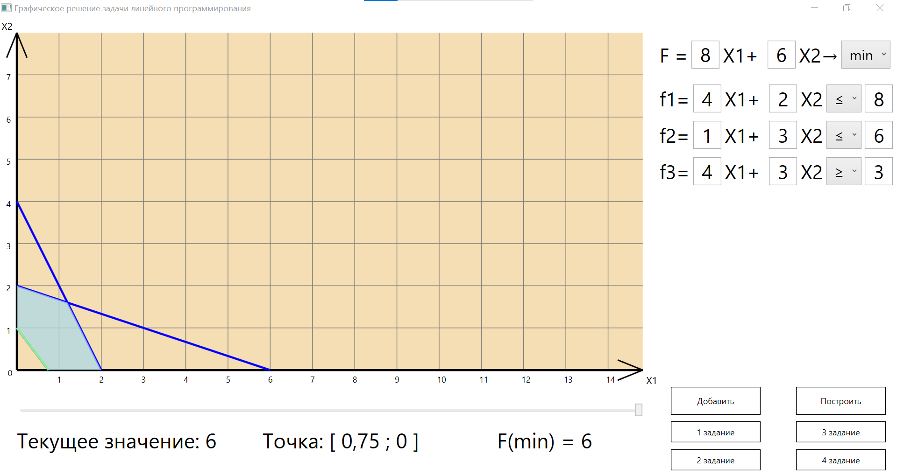

# Модель работы уличных фонарей с автоматическим включением в разных условиях
<h4>Один из моих первых проектов, связанных с изучением ООП - проект под названием PW_OOP. Суть в том, что в ночное время фонари загораются, когда человек входит в их область. Днём же фонари отключаются из-за ненадобности.</h4> 
<h5>Написан проект на C++/CLI на Windows Forms</h5>

  
  
<em>Демонстрация работы программы</em>

# Разработка и исследование алгоритмов на деревьях на основе динамических структур данных
<h4>Следующие интересные проекты, которые я реализовывал это - программы, посвящённые графам и деревьям.</h4>
<h4>Представленная ниже программа решает следующие задачи: </h4>
<h4>1. Ищет кратчайший путь от заданной вершины до всех остальных вершин графа с помощью алгоритма Дейкстры и Флойда.</h4>
<h4>2. Помогает Оле добраться до выбранных городов и вернуться в изначальный самым кратчайшим путём.</h4>
<h5>Написан проект также на C++/CLI на Windows Forms</h5>

  
  

# Разработка алгоритмов формирования и обработки двоичных деревьев поиска, авл-деревьев и B-деревьев
<h4>Следующая программа решает много задач. Из основных - это:</h4>
<h4> ● Построение простого бинарного дерева</h4>
<h4> ● Построение строгого бинарного дерева</h4>
<h4> ● Построение идеально сбалансированного дерева из положительных элементов</h4>
<h4> ● Построение идеально сбалансированного дерева из отрицательных элементов</h4>
<h4> ● Построение B+ дерева</h4>
<h4> ● Построение Красно-чёрного дерева</h4>
<h5>Написан проект также на C++/CLI на Windows Forms</h5>

  
  
<em>Демонстрация работы программы</em>

#Графическое решение задачи линейного программирования
<h4>Далее были проекты посвящённые линейному программированию. Суть задачи состояла в том, чтобы написать программу графически решающую ЗЛП без использования дополнительных библиотек для формирования осей координат и графиков.</h4>
<h5>Из особенностей программы можно выделить, что ограничений можно добавлять сколько угодно, а также менять масштаб осей координат.</h5>
<h5>Этот проект был написан на C# с использованием WPF</h5>

  <!-- Первая строка -->
  

    

      
      
<em>Поиск F(max)</em>

    

    

      
      
<em>Поиск F(min)</em>

    

  

  <!-- Вторая строка -->
  

    

      
      
<em>Поиск F(max) = ∞</em>

    

    

      
      
<em>Поиск F(min) = 0</em>

    

  

